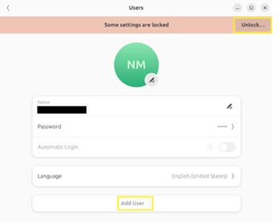
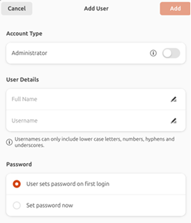
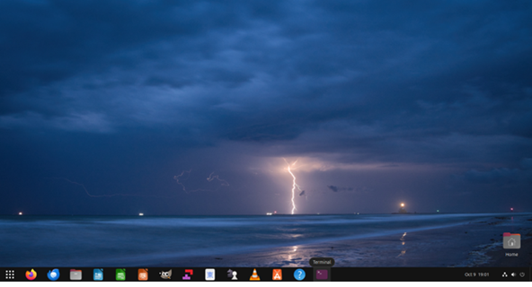
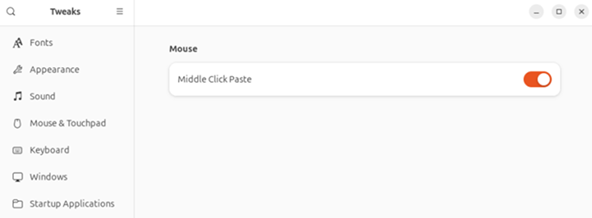
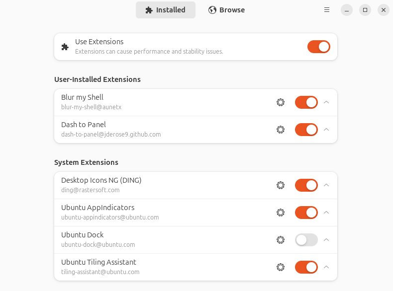
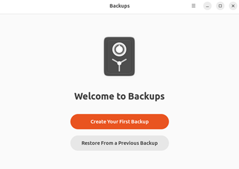
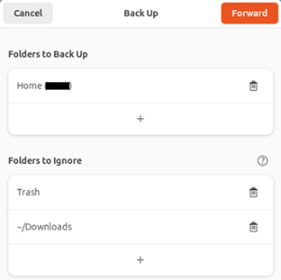
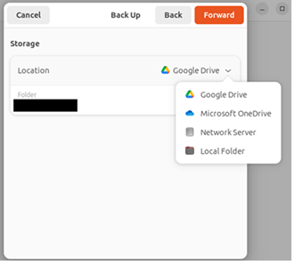

The **Beginner’s Guide to the Ubuntu Desktop User Experience** is crafted as a comprehensive resource for anyone embarking on their Linux journey. It offers clear, practical guidance tailored for beginners and hobbyists exploring Linux for the first time.

This guide brings together collaborative knowledge and trusted resources to help new users confidently set up Ubuntu virtual machines or desktop systems with ease. With its intuitive interface, robust community support, and reliable ecosystem, **Ubuntu remains one of the most accessible and welcoming pathways into the world of Linux**.

---

### Ubuntu Releases

#### Ubuntu 24.04 LTS – *Noble Numbat* (Recommended)
For maximum stability and long-term reliability, **Ubuntu 24.04 LTS** is the recommended release.

- Supported for **5 years**
- Optional **10-year Extended Security Maintenance (ESM)** for enterprise environments

[Ubuntu LTS lifecycle details](https://ubuntu.com/about/release-cycle](https://ubuntu.com/about/release-cycle)

#### Ubuntu Interim Releases
Interim releases (such as **24.10**) are supported for **9 months** and are ideal for users who want newer features, updated drivers, and the latest software stacks and are comfortable upgrading regularly.

Download Ubuntu Desktop ISOs:  
[https://ubuntu.com/download/desktop](https://ubuntu.com/download/desktop)

---

### Ubuntu Official Desktop Guide: An Essential Starting Point

Linux desktop environments have matured significantly, making Linux more accessible than ever. Learning Linux today is supported by extensive **documentation, tutorials, forums, and community-driven resources**.

#### Key Ubuntu Resources

- [Ubuntu Desktop Guide](https://help.ubuntu.com)
- [Ubuntu Help](https://help.ubuntu.com)
- [Ask Ubuntu](https://askubuntu.com)
- [Command Line for Beginners](https://ubuntu.com/tutorials/command-line-for-beginners#1-overview)

---

### Installing Ubuntu Desktop

Ubuntu provides a [**step-by-step installation guide**](https://ubuntu.com/tutorials/install-ubuntu-desktop
) for installing Ubuntu on laptops or desktop computers as a primary operating system:  

**Disclaimer:** Always back up your data before installing or dual-booting.

---

### Virtualization: A Secure Learning Environment

Virtualization is an excellent method for learning Linux **without risking your primary system**.

#### Popular Virtualization Platforms

- [Oracle VirtualBox](https://www.virtualbox.org)
- [Ubuntu VM Guide for VirtualBox 7](  https://ubuntu.com/tutorials/how-to-run-ubuntu-desktop-on-a-virtual-machine-using-virtualbox)
- [VMware Workstation Pro & Fusion (Free for personal use)](https://www.vmware.com/products/workstation-pro.html)

#### VirtualBox Documentation & Training

- [VirtualBox Documentation](https://www.virtualbox.org/wiki/Documentation)

Snapshots allow users to easily revert failed experiments, making virtualization ideal for beginners.

#### VirtualBox Guides for Ubuntu and Zorin

- [Ubuntu VirtualBox Guide](https://ubuntu.com/tutorials/how-to-run-ubuntu-desktop-on-a-virtual-machine-using-virtualbox#1-overview)
- [Zorin OS VirtualBox Guide](https://help.zorin.com/docs/getting-started/install-zorin-os-in-virtualbox/)

---

#### Users and Groups (GUI Method)

Although the Linux terminal can feel intimidating, Ubuntu provides **GUI-based user management**.

### Steps

1. Open **Settings**  
2. Search for **Users**  
3. Click **Unlock** and enter the administrator password  
4. Select **Add User**  
5. Disable **Automatic Login** (recommended for security)

  

### Best Practices

- Use a **standard account** for daily work  
- Use an **administrator account** only when elevated privileges are required  

---

### Customizing Ubuntu with GNOME Tweaks & Extension Manager

### GNOME Tweaks

GNOME Tweaks allows deeper customization beyond standard system settings.

Install GNOME Tweaks via the following Terminal command line:

**sudo apt install gnome-tweaks**

Launch GNOME Tweaks via the following Terminal command line:

**gnome-tweaks**

---

### Extension Manager

**Extension Manager** simplifies browsing, installing, and managing GNOME Shell extensions.

Install from **Ubuntu App Center**  
Search for: **Extension Manager**

#### Recommended GNOME Shell Extensions

- **Blur My Shell** – Blur effects for panels and docks  
- **Dash to Panel** – Windows-style taskbar  
- **Dash to Dock** – macOS-style dock  
- **User Themes** – Apply custom shell themes  
- **Vitals** – Displays CPU, RAM, disk, temperature, and network stats  

[Browse Gnome extensions](https://extensions.gnome.org)

---

### Effective Backup Methods

Data loss can severely impact both home and business users. Backups protect against:

- Hardware failure
- Accidental deletion
- Malware and ransomware

### Deja Dup (Built-in Backup Tool)

Deja Dup offers a simple GUI-based backup solution. To install (if not already installed) via Terminal:

**sudo apt install deja-dup**

In the Applications menu, proceed to open Deja Dup. Alternatively, search for “Backup” or Deja Dup” and open the application.

Once Deja Dup is opened, proceed to configure the backup settings. There are options for your backup location, schedule, and other preferences. The storage location can be local, network or cloud. Specify the desired folders to be included or excluded from backups.

When selecting Forward, in Location, there are options to save files to Google Drive, Microsoft OneDrive, Network Server and Local Folder. An external hard drive, USC Thumb Drive, or a WD My Cloud Home, Synology or Qnap NAS are also viable options for backup.

### Supported Backup Locations

- Local folders
- Network servers
- Google Drive
- Microsoft OneDrive
- External drives
- NAS devices (Synology, QNAP)

**Encryption** is optional but highly recommended. To	**Set Encryption (Optional)** -> for added security, you have the option to encrypt your backup for added security. Be sure to remember the password. Click on **Forward** to complete the process.

**Official guide:** [DejaDup](https://help.ubuntu.com/community/DejaDup)

---

#### Configuring Samba
Samba enables cross-platform file sharing between Linux, Windows, and macOS.

**Official Ubuntu Samba Guide:**
[Samba](https://help.ubuntu.com/community/Samba)

---

#### Popular Software Applications

- [LibreOffice](https://www.libreoffice.org/) – Office suite
- [OnlyOffice](https://www.onlyoffice.com/) – Microsoft-compatible office tools
- [Thunderbird](https://www.thunderbird.net/en-CA/) – Email, calendar, RSS
- [GNOME Calendar](https://apps.gnome.org/Calendar/) – Calendar sync support
- [Firefox](https://www.firefox.com/en-CA/?utm_campaign=SET_DEFAULT_BROWSER) – Default privacy-focused browser
- [GIMP](https://www.gimp.org/) – Advanced image editor
- [VLC](https://www.videolan.org/vlc/) – Universal media player
- [Zoom](https://www.zoom.com/) – Video conferencing

**Microsoft 365 Web** works well on Ubuntu, but lacks:

- Excel macros
- Advanced add-ins
- Large dataset performance

---

#### Cheatsheats

- [Quick One-Page Command Line Cheat Sheet](cheatsheet/Linux-Cheatsheet-(Ubuntu).pdf)
- [Complete Ubuntu Command Line Cheat Sheet (2-Pages)](cheatsheet/Ubuntu-Linux-Cheatsheet.pdf)

---

--- 

#### Usage & Disclaimer

This content is provided for educational and reference purposes only. Scripts and procedures are used at your own risk. Always back up critical data and follow organizational policies, security standards, and official vendor documentation. If unsure, consult a qualified IT professional.

--- 

### Final Thoughts

Linux continues to grow in popularity due to its flexibility, performance, and security.

- **Ubuntu** is an excellent starting point  
- **Zorin OS** is ideal for users transitioning from Windows or macOS  
