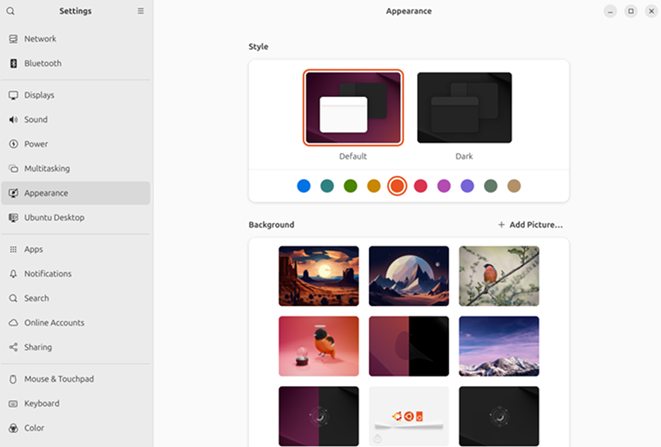

# Ubuntu-Essentials-Guide
Beginner’s Guide to Ubuntu Desktop

The **Beginner’s Guide to the Ubuntu Desktop User Experience** is crafted as a comprehensive resource for anyone embarking on their Linux journey. It offers clear, practical guidance tailored for beginners and hobbyists exploring Linux for the first time.

This guide brings together collaborative knowledge and trusted resources to help new users confidently set up Ubuntu virtual machines or desktop systems with ease. With its intuitive interface, robust community support, and reliable ecosystem, **Ubuntu remains one of the most accessible and welcoming pathways into the world of Linux**.

---

## Ubuntu Releases
### Ubuntu 25.10 – *Questing Quokka*
**Ubuntu 25.10** is the latest **interim release**, supported until **July 2026**.  Interim releases are ideal for users who want **cutting-edge technology** and are comfortable upgrading every **nine (9) months**. These releases include newer software stacks and updated hardware drivers.

---

### Ubuntu 24.04.3 LTS (Recommended for Stability)
For maximum stability and long-term reliability, **Ubuntu 24.04.3 LTS** remains a trusted choice.

- Supported for **5 years**
- Optional **10-year Extended Security Maintenance (ESM)** for enterprise environments

**Ubuntu 26.04 LTS – “Resolute Raccoon”** is scheduled for release on **April 23, 2025**.

Ubuntu LTS lifecycle details can be found [**here**](https://ubuntu.com/about/release-cycle). Download the **Ubuntu 24.04.4 LTS** and **Ubunto 25.10** ISOs [here](https://ubuntu.com/download/desktop). 

---

## Ubuntu Official Desktop Guide: An Essential Starting Point

Linux desktop environments have matured significantly, making Linux more accessible than ever. Learning Linux today is supported by extensive **documentation, tutorials, forums, and community-driven resources**.

### Key Ubuntu Resources

The [**Ubuntu Desktop Guide**](https://help.ubuntu.com) serves as the fundamental resource for new users to familiarize themselves with the Ubuntu desktop environment. It provides essential support information, including resources, such as [**Ubuntu Help**](https://help.ubuntu.com/) and [**Ask Ubuntu**](https://askubuntu.com/) forum. For beginners learning Linux command lines on Ubuntu, a specific guide can be found [here](https://ubuntu.com/tutorials/command-line-for-beginners#1-overview).

---

### Installing Ubuntu Desktop

Ubuntu provides a [**step-by-step installation guide**](https://ubuntu.com/tutorials/install-ubuntu-desktop) for installing Ubuntu on laptops or desktop computers as a primary operating system. 

**Disclaimer:** Always back up your data before installing or dual-booting.

---

### Virtualization: A Secure Learning Environment

Virtualization is an excellent method for learning Linux **without risking your primary system**.

#### Popular Virtualization Platforms

- [**Oracle VirtualBox**](https://www.virtualbox.org)
- [**Ubuntu VM guide for VirtualBox 7**](https://ubuntu.com/tutorials/how-to-run-ubuntu-desktop-on-a-virtual-machine-using-virtualbox)
- [**VMware Workstation Pro & Fusion (Free for Personal Use)**](https://www.vmware.com/products/workstation-pro.html)

#### VirtualBox Documentation & Training

- [**VirtualBox Documentation**](https://www.virtualbox.org/wiki/Documentation) 

Snapshots allow users to **revert failed experiments easily**, making virtualization ideal for beginners.

#### VirtualBox Guides for Ubuntu and Zorin

- [Ubuntu's VirtualBox Guide](https://ubuntu.com/tutorials/how-to-run-ubuntu-desktop-on-a-virtual-machine-using-virtualbox#1-overview)
- [Zorin's VirtualBox Guide](https://help.zorin.com/docs/getting-started/install-zorin-os-in-virtualbox/)

---

### Users and Groups (GUI Method)

Although the Linux terminal can feel intimidating, Ubuntu provides **GUI-based user management**.

**Steps**

1. Open **Settings**
2. Search for **Users**
3. Click **Unlock** and enter the administrator password

   
5. Select **Add User**

7. Disable **Automatic Login** (recommended for security)

**Best Practice**
- Use a **standard account** for daily work
- Use an **administrator account** only when elevated privileges are required

---

### Customizing Ubuntu with GNOME Tweaks & Extension Manager

### GNOME Tweaks

GNOME Tweaks allows deeper customization beyond standard system settings.

#### Install GNOME Tweaks

Proceed to install GNOME Tweaks with the following Terminal command

**sudo apt install gnome-tweaks**

**Launch GNOME Tweaks** via Terminal command line: **gnome-tweaks**

---

### Extension Manager

**Extension Manager** simplifies browsing, installing, and managing GNOME Shell extensions.

**Install from Ubuntu App Center**
Search: **Extension Manager**

#### **Recommended GNOME Shell Extensions**

- **Blur My Shell** – Adds blur effects to panels and the dock
- **Dash to Panel** – Traditional Windows-style taskbar
- **Dash to Dock** – macOS-like dock at the bottom
- **User Themes** – Apply custom GNOME Shell themes
- **Vitals** – Displays CPU, RAM, disk, temperature, and network stats

More extensions can be found at [https://extensions.gnome.org](https://extensions.gnome.org)

#### Themes and customization
[Gnome-Look](https://www.gnome-look.org)
[Pling](https://pling.com)

Under Appearance in the left pane, further customizations of the Linux desktop can be adjusted to personal preferences.

In the Ubuntu Desktop on the left pane, useful customization option includes the adjustment of desktop icon, dock, and enhancing tiling.

---

#### Antivirus Protection – **ClamAV**

ClamAV detects viruses, trojans, and malware on Linux systems. Install via Ubuntu Software Center or via terminal:

**sudo apt install clamav**

#### Alternative antivirus options for Ubuntu:
[Best Antivirus For Linux](https://linuxhint.com/best_antivirus_linux)

---

### Configuring Firewall on Ubuntu

Ubuntu uses UFW (Uncomplicated Firewall) by default.

- Disabled by default
- Designed for simplicity and effectiveness
- GUI Firewall (Recommended for Beginners)
- GUFW – graphical front end for UFW

sudo apt install gufw

### Why Firewalls Matter

- Security – Controls traffic based on rules
- Access Control – Restricts exposed services
- Network Segmentation – Limits lateral threats

[UFW documentation](https://help.ubuntu.com/community/UFW) is a great starting point to learn more about Uncomplicated Firewalls in Ubuntu. 

---

### Effective Backup Methods

Data loss can severely impact both home and business users. Backups protect against:

- Hardware failure
- Accidental deletion
- Malware and ransomware

### Deja Dup (Built-in Backup Tool)

Deja Dup offers a simple GUI-based backup solution. To install (if not already installed) via Terminal:

**sudo apt install deja-dup**

In the Applications menu, proceed to open Deja Dup. Alternatively, search for “Backup” or Deja Dup” and open the application.

Once Deja Dup is opened, proceed to configure the backup settings. There are options for your backup location, schedule, and other preferences. The storage location can be local, network or cloud. Specify the desired folders to be included or excluded from backups.

When selecting Forward, in Location, there are options to save files to Google Drive, Microsoft OneDrive, Network Server and Local Folder. An external hard drive, USC Thumb Drive, or a WD My Cloud Home, Synology or Qnap NAS are also viable options for backup.

### Supported Backup Locations

- Local folders
- Network servers
- Google Drive
- Microsoft OneDrive
- External drives
- NAS devices (Synology, QNAP)

**Encryption** is optional but highly recommended. To	**Set Encryption (Optional)** -> for added security, you have the option to encrypt your backup for added security. Be sure to remember the password. Click on **Forward** to complete the process.

**Official guide:** [DejaDup](https://help.ubuntu.com/community/DejaDup)

---

### Understanding File Management

Graphical File Manager: Nautilus

Nautilus allows users to:

- Create, rename, move, delete files
- Drag & drop folders
- View file properties and permissions
- Navigate easily using the sidebar

--- 
### Why Learn Terminal File Management?

The terminal provides **speed, precision, and power**, especially when:

- Managing permissions
- Working on servers
- Automating tasks

---

### Linux File Permissions Explained

**Permission Structure**
- Owner
- Group
- Others

Permissions include:

r – read
w – write
x – execute

**Example**
-rwxr-xr-- 1 user group 1234 Jul 27 10:15 script.sh

**Using chmod**

#### Symbolic Mode

chmod +x filename
chmod g-w filename

Numeric Mode
chmod 754 filename

#### Numeric Permission Reference

- 777 – Full access for all
- 764 – Owner full, group read/write
- 755 – Owner full, others read/execute
- 744 – Owner full, others read
- 740 – Owner full, group read only

### Configuring Samba
Samba enables cross-platform file sharing between Linux, Windows, and macOS.

**Official Ubuntu Samba Guide:**
[https://help.ubuntu.com/community/Samba]([https://help.ubuntu.com/community/Samba)

#### Popular Software Applications

- [LibreOffice](https://www.libreoffice.org/) – Office suite
- [OnlyOffice](https://www.onlyoffice.com/) – Microsoft-compatible office tools
- [Thunderbird](https://www.thunderbird.net/en-CA/) – Email, calendar, RSS
- [GNOME Calendar](https://apps.gnome.org/Calendar/) – Calendar sync support
- [Firefox](https://www.firefox.com/en-CA/?utm_campaign=SET_DEFAULT_BROWSER) – Default privacy-focused browser
- [GIMP](https://www.gimp.org/) – Advanced image editor
- [VLC](https://www.videolan.org/vlc/) – Universal media player
- [Zoom](https://www.zoom.com/) – Video conferencing

**Microsoft 365 Web** works well on Ubuntu, but lacks:

- Excel macros
- Advanced add-ins
- Large dataset performance

#### Zorin OS 18 – Easy Transition from Windows or macOS
Zorin OS 18 offers:

- Windows-like layout
- Performance optimizations
- User-friendly experience for newcomers

VirtualBox installation guide for Zorin OS:
[https://zorin.com/os/](https://zorin.com/os/)

--- 
#### Final Thoughts
Linux continues to grow in popularity thanks to its flexibility, performance, and customization options.

**Ubuntu** is an excellent starting point
**Zorin** is ideal for Windows/macOS users

Other notable distros:

- [Fedora 43](https://www.fedoraproject.org/)
- [Linux Mint 22.2](https://linuxmint.com/)
- [Manjaro](https://manjaro.org/)

